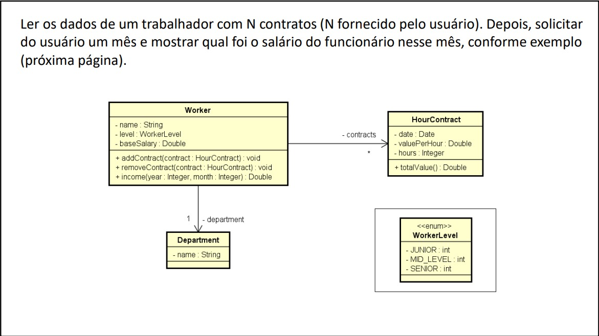

# DadosFuncionarios
Programa de controle de funcionários.

## Programa baseado em um Diagrama de Classes UML
### 🌱 Utilizando C#, e o padrão de projeto MVC, desenvolvi esse simples software de administração de funcionários.
### O programa usa o conceito de listas e criação dinâmicas de objetos.

# UML usada para a criação do projeto

